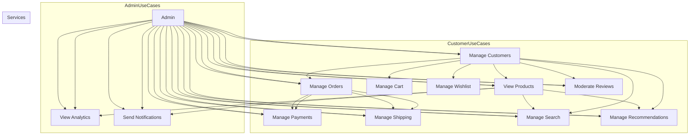
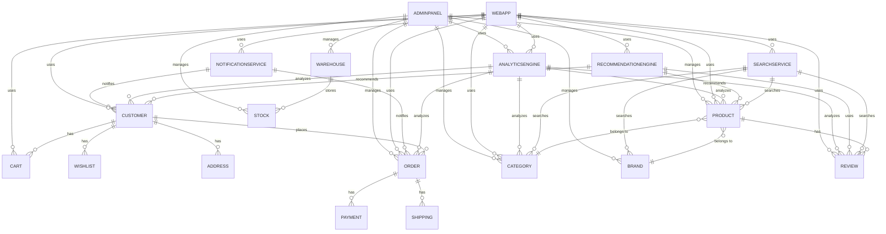

# E-commerce Toolkit for Laravel

[](https://packagist.org/packages/jmrashed/ecommerce)
[](https://packagist.org/packages/jmrashed/ecommerce)
[](https://packagist.org/packages/jmrashed/ecommerce)

The E-commerce Toolkit for Laravel is a modular package providing essential features for building e-commerce websites. This package includes functionalities for managing product catalogs, carts, checkout systems, payment gateway integrations, and order management.

## Features


- **Product Catalogs**: Manage products, categories, brands, and attributes.
- **Shopping Cart**: Add, update, and remove items from the cart with session management.
- **Wishlist**: Customers can add products to their wishlist for future reference.
- **Product Reviews**: Customers can review products and view all reviews per product.
- **Checkout System**: Streamlined checkout process with customizable steps and shipping selection.
- **Coupon/Discount System**: Apply and remove coupons for cart discounts.
- **Order Management**: Track and manage orders from creation to fulfillment.
- **Shipping Management**: Admin can manage shipping methods; customers select shipping during checkout.
- **Customer Panel**: Dashboard, orders, addresses, reviews, wishlist, and profile management for customers.
- **Admin Panel**: Full management of products, categories, brands, orders, customers, reviews, coupons, shippings, and dashboard.
- **Multi-language and Currency Support**: Cater to a global audience with localization features.
- **Responsive Design**: Ensure a seamless experience across all devices.

## Folder Structure

```tree
ecommerce
|   .gitignore
|   CHANGELOG.md
|   CODE_OF_CONDUCT.md
|   composer.json
|   composer.lock
|   LICENSE
|   package-lock.json
|   README.md
|   tree.txt
|   
+---config
|       auth.php
|       ecommerce.php
|       
+---database
|   +---factories
|   |       ProductFactory.php
|   |       
|   +---migrations
|   |       2024_05_25_000098_create_pkg_customers_table.php
|   |       2024_05_25_000099_create_pkg_addresses_table.php
|   |       2024_05_25_000100_create_pkg_brands_table.php
|   |       2024_05_25_000101_create_pkg_categories_table.php
|   |       2024_05_25_000101_create_pkg_products_table.php
|   |       2024_05_25_000102_create_pkg_product_images_table.php
|   |       2024_05_25_000102_create_pkg_tags_table.php
|   |       2024_05_25_000103_create_pkg_orders_table.php
|   |       2024_05_25_000103_create_pkg_product_tags_table.php
|   |       2024_05_25_000105_create_pkg_order_items_table.php
|   |       2024_05_25_000106_create_pkg_reviews_table.php
|   |       2024_05_25_000107_create_pkg_cart_items_table.php
|   |       2024_05_25_000107_create_pkg_coupons_table.php
|   |       2024_05_25_000107_create_pkg_payments_table.php
|   |       2024_05_25_000107_create_pkg_shippings_table.php
|   |       2024_05_25_000107_create_pkg_wishlists_table.php
|   |       2025_10_01_133922_create_users_table.php
|   |       
|   \---seeders
|           AddressSeeder.php
|           BrandsTableSeeder.php
|           CartItemSeeder.php
|           CategoriesTableSeeder.php
|           CouponSeeder.php
|           CustomersTableSeeder.php
|           DatabaseSeeder.php
|           OrderItemSeeder.php
|           OrderSeeder.php
|           PaymentSeeder.php
|           ProductImageSeeder.php
|           ProductsTableSeeder.php
|           ReviewSeeder.php
|           TagsTableSeeder.php
|           UserSeeder.php
|           
+---resources
|   +---assets
|   |   +---css
|   |   |       ecommerce.css
|   |   |       
|   |   \---js
|   |           ecommerce.js
|   |           
|   +---lang
|   |   \---en
|   |           ecommerce.php
|   |           
|   \---views
|       +---admin
|       |   |   dashboard.blade.php
|       |   |   
|       |   +---brands
|       |   |       create.blade.php
|       |   |       edit.blade.php
|       |   |       index.blade.php
|       |   |       show.blade.php
|       |   |       
|       |   +---categories
|       |   |       create.blade.php
|       |   |       edit.blade.php
|       |   |       index.blade.php
|       |   |       show.blade.php
|       |   |       
|       |   +---coupons
|       |   |       create.blade.php
|       |   |       edit.blade.php
|       |   |       index.blade.php
|       |   |       show.blade.php
|       |   |       
|       |   +---customers
|       |   |       edit.blade.php
|       |   |       index.blade.php
|       |   |       show.blade.php
|       |   |       
|       |   +---orders
|       |   |       edit.blade.php
|       |   |       index.blade.php
|       |   |       show.blade.php
|       |   |       
|       |   +---products
|       |   |       create.blade.php
|       |   |       edit.blade.php
|       |   |       index.blade.php
|       |   |       show.blade.php
|       |   |       
|       |   +---reviews
|       |   |       edit.blade.php
|       |   |       index.blade.php
|       |   |       show.blade.php
|       |   |       
|       |   +---shipping
|       |   |       create.blade.php
|       |   |       edit.blade.php
|       |   |       index.blade.php
|       |   |       
|       |   \---shippings
|       |           create.blade.php
|       |           edit.blade.php
|       |           index.blade.php
|       |           show.blade.php
|       |           
|       +---cart
|       |       coupon_form.blade.php
|       |       index.blade.php
|       |       
|       +---checkout
|       |       confirmation.blade.php
|       |       index.blade.php
|       |       shipping_select.blade.php
|       |       
|       +---customer
|       |       addresses.blade.php
|       |       dashboard.blade.php
|       |       orders.blade.php
|       |       order_detail.blade.php
|       |       profile_edit.blade.php
|       |       reviews.blade.php
|       |       wishlist.blade.php
|       |       
|       +---layouts
|       |       app.blade.php
|       |       
|       +---products
|       |       index.blade.php
|       |       show.blade.php
|       |       
|       +---reviews
|       |       create.blade.php
|       |       index.blade.php
|       |       
|       \---wishlist
|               add_button.blade.php
|               index.blade.php
|               
+---routes
|       web.php
|       
+---src
|   |   EcommerceServiceProvider.php
|   |   
|   +---Console
|   |   \---Commands
|   |           InstallEcommercePackage.php
|   |           
|   +---Http
|   |   +---Controllers
|   |   |       AdminBrandController.php
|   |   |       AdminCategoryController.php
|   |   |       AdminCouponController.php
|   |   |       AdminCustomerController.php
|   |   |       AdminOrderController.php
|   |   |       AdminPanelController.php
|   |   |       AdminProductController.php
|   |   |       AdminReviewController.php
|   |   |       AdminShippingController.php
|   |   |       CartController.php
|   |   |       CheckoutController.php
|   |   |       CouponController.php
|   |   |       CustomerAuthController.php
|   |   |       CustomerPanelController.php
|   |   |       ProductController.php
|   |   |       ReviewController.php
|   |   |       ShippingController.php
|   |   |       WishlistController.php
|   |   |       
|   |   \---Middleware
|   |           CheckCart.php
|   |           
|   +---Models
|   |       Address.php
|   |       Brand.php
|   |       CartItem.php
|   |       Category.php
|   |       Coupon.php
|   |       Customer.php
|   |       Order.php
|   |       OrderItem.php
|   |       Payment.php
|   |       Product.php
|   |       ProductImage.php
|   |       Review.php
|   |       Shipping.php
|   |       Tag.php
|   |       User.php
|   |       Wishlist.php
|   |       
|   +---Repositories
|   |       ProductRepository.php
|   |       
|   \---Services
|           CartService.php
|           OrderService.php
|           PaymentService.php
|           ProductService.php
|           
+---tests
|   \---Unit
|           TestCase.php
|           
\---vendor
    |   autoload.php
    |   
    \---composer
            autoload_classmap.php
            autoload_namespaces.php
            autoload_psr4.php
            autoload_real.php
            autoload_static.php
            ClassLoader.php
            LICENSE
            

```

### Dataflow Diagram

```mermaid
graph TD
    subgraph Catalog
        A[Product] --> B[Category]
        A --> C[Brand]
        B --> A
        C --> A
    end
    
    subgraph Customer
        G[Customer] --> I[Cart]
        G --> J[Wishlist]
        G --> K[Address]
        I --> G
        J --> G
        K --> G
        G --> P[Review]
        G --> Q[Coupon]
        G --> R[Shipping]
    end
    
    subgraph OrderManagement
        F[Order] --> L[Payment]
        F --> M[Shipping]
        L --> F
        M --> F
        F --> Q[Coupon]
    end
    
    subgraph ReviewManagement
        D[Review] --> A
        D --> G
        D --> F[Order]
    end
    
    subgraph Inventory
        N[Warehouse] --> A
        O[Stock] --> N
        N --> O
    end

    subgraph AdminPanel
        S[Admin] --> T[Product Management]
        S --> U[Category Management]
        S --> V[Brand Management]
        S --> W[Order Management]
        S --> X[Customer Management]
        S --> Y[Review Management]
        S --> Z[Coupon Management]
        S --> AA[Shipping Management]
    end
    end
    
    subgraph Search
        P[SearchService] --> A
        P --> B
        P --> C
        P --> D
    end
    
    subgraph Recommendation
        Q[RecommendationEngine] --> A
        Q --> G
        Q --> D
    end
    
    subgraph Analytics
        R[AnalyticsEngine] --> G
        R --> A
        R --> F
        R --> D
        R --> B
    end
    
    subgraph Notifications
        S[NotificationService] --> G
        S --> F
    end
    
    subgraph UserInterface
        T[WebApp] --> G
        T --> A
        T --> I
        T --> F
        T --> P
        T --> Q
        T --> S
        T --> R
        T --> D
        T --> B
        T --> C
    end
    
    subgraph AdminInterface
        U[AdminPanel] --> A
        U --> B
        U --> C
        U --> F
        U --> N
        U --> O
        U --> R
    end
    
    T -.-> U

```


### Use Case Diagram



### Database Design 




## Installation

To install the package, use Composer:

```bash
composer require jmrashed/ecommerce
```

After installing, publish the package resources:

```bash
php artisan vendor:publish --provider="Jmrashed\Ecommerce\EcommerceServiceProvider"
```

Run the migrations to set up the necessary database tables:

```bash
php artisan migrate
```

## Configuration

After publishing the package resources, you can configure the package by editing the configuration file located at `config/ecommerce.php`.

```php
return [
    'currency' => 'USD',
    'payment_gateways' => [
        'stripe' => [
            'api_key' => env('STRIPE_API_KEY'),
        ],
        'paypal' => [
            'client_id' => env('PAYPAL_CLIENT_ID'),
            'client_secret' => env('PAYPAL_CLIENT_SECRET'),
        ],
    ],
];
```

## Usage

### Product Management

To create a new product, use the provided model and controller:

```php
use Jmrashed\Ecommerce\Models\Product;

$product = new Product();
$product->name = 'Sample Product';
$product->price = 19.99;
$product->description = 'This is a sample product.';
$product->save();
```

### Cart Operations

Add items to the cart:

```php
use Jmrashed\Ecommerce\Facades\Cart;

Cart::add($productId, $quantity);
```

Retrieve items from the cart:

```php
$items = Cart::content();
```

### Checkout Process

Initiate the checkout process by redirecting to the checkout route:

```php
return redirect()->route('ecommerce.checkout');
```

Handle payment and order processing through provided controllers and routes.

## Contributing

Contributions are welcome! Please follow these steps to contribute:

1. Fork the repository.
2. Create a new branch (`git checkout -b feature/your-feature`).
3. Commit your changes (`git commit -am 'Add some feature'`).
4. Push to the branch (`git push origin feature/your-feature`).
5. Open a Pull Request.

Please adhere to the [code of conduct](CODE_OF_CONDUCT.md).

## License

The E-commerce Toolkit for Laravel is open-source software licensed under the [MIT license](LICENSE).

## Support

If you encounter any issues or have any questions, feel free to open an issue on GitHub or contact the maintainer at [jmrashed@gmail.com](mailto:jmrashed@gmail.com).

## Statistics


Thank you for using the E-commerce Toolkit for Laravel! We hope it helps you build amazing e-commerce websites.
